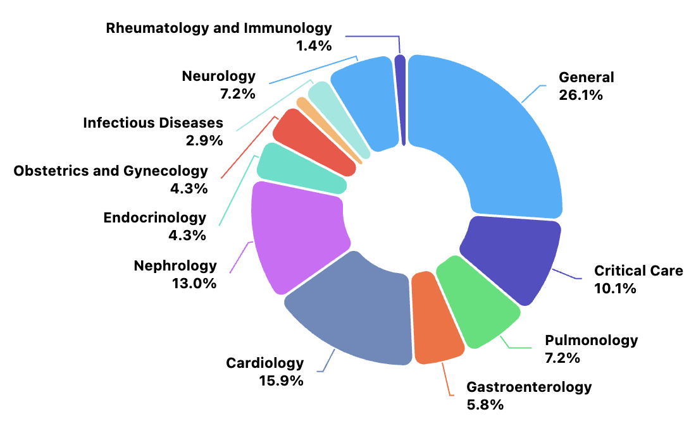

# [EMNLP 2025] CMedCalc-Bench: A Fine-Grained Benchmark for Chinese Medical Calculations in LLMs

This repository is the official release of **[CMedCalc-Bench](https://aclanthology.org/2025.emnlp-main.1302/)**.

[](https://aclanthology.org/2025.emnlp-main.1302/)
[](https://aclanthology.org/2025.emnlp-main.1302.pdf)
[](https://doi.org/10.18653/v1/2025.emnlp-main.1302)
[](https://2025.emnlp.org/)

## 🔥 News

- **`2025/11`**: CMedCalc-Bench is accepted to **EMNLP 2025 Main Conference**.
- **`2025/11`**: We release the benchmark data and evaluation toolkit.

**📖 Table of Contents**

- [Overview](#-overview)
- [Dataset](#-dataset)
- [Data Format](#-data-format)
- [Evaluation Protocol](#-evaluation-protocol)
- [Quick Start](#-quick-start)
- [Repository Structure](#-repository-structure)
- [Ethics & Disclaimer](#-ethics--disclaimer)
- [Citation](#-citation)

## ✨ Overview

Large Language Models (LLMs) show strong potential in medical diagnosis and clinical decision-making, yet most biomedical NLP benchmarks focus on **qualitative** reasoning and overlook **quantitative clinical calculation**, especially in Chinese.

We introduce **CMedCalc-Bench**, a fine-grained benchmark for Chinese medical calculations:

- **69** clinically used calculators across **12** departments
- **1,143** real-world patient cases for main evaluation
- Three calculator types: **equation-based**, **rule-based**, and **semantic-based**
- A **four-stage** evaluation framework: Knowledge Acquisition → Parameter Extraction → Unit Conversion → Calculation/Comprehension
- Additional analyses on **faithful reasoning** (refusal under missing/contradictory inputs) and the **demonstration effect**

<p align="center">
  
  <br/>
  <em>Department distribution of CMedCalc-Bench.</em>
</p>

## 📦 Dataset

Main evaluation set (**1,143** instances):

| Split | File | #Instances | Description |
| --- | --- | ---: | --- |
| Equation-based | `data/equation.json` | 585 | Formula-driven numerical calculation |
| Rule-based | `data/score.json` | 396 | Score / scale accumulation |
| Semantic-based | `data/semantic.json` | 162 | Semantic grading / classification |
| **Total** | — | **1,143** | Main benchmark |

Faithful reasoning set:

| Split | File | #Instances | Description |
| --- | --- | ---: | --- |
| Faithful | `data/faithful.json` | 401 | Uncomputable cases (missing / contradictory evidence); models should abstain |

### Key Statistics

| | Equation | Rule | Semantic | Overall |
| --- | ---: | ---: | ---: | ---: |
| #Calculators | 37 | 20 | 12 | 69 |
| #Instances | 585 | 396 | 162 | 1,143 |
| Avg. note length | 1495.3 | 258.0 | 209.7 | 884.4 |

## 🗂️ Data Format

### `equation.json`

```json
{
  "id": 1,
  "科室": "一般通用",
  "指标名称": "体重指数(BMI)",
  "formula": "体重指数（BMI）=体重/身高^2",
  "record_final": "患者病历文本...",
  "input_params_final": {"sex": "Female", "age": [27, "years"], "weight": [65.0, "kg"], "height": [1.62, "m"]},
  "answer_final": {"value": "24.8", "unit": "kg/m²"},
  "explanation_final": "逐步计算说明..."
}
```

### `score.json` (rule-based)

```json
{
  "id": 1,
  "科室": "急危重症",
  "指标名称": "急性生理与慢性健康评分II（APACHE II）",
  "record_final": "患者病历文本...",
  "extracted_entities_final": "{'年龄': [43.0, '岁'], ...}",
  "answer_final": "14",
  "explanation_final": "逐步评分说明..."
}
```

### `semantic.json`

```json
{
  "id": 1,
  "科室": "一般通用",
  "指标名称": "MRC肌力分级",
  "record_final": "患者病历文本...",
  "answer_final": "0级",
  "explanation_final": "分级依据说明..."
}
```

### `faithful.json`

```json
{
  "id": 1,
  "指标名称": "烧伤面积(九分法)",
  "type": "describeContent",
  "missing": {"hit": "关键参数缺失说明..."},
  "record_final": "信息不完整的病历...",
  "input_parameters_final": "",
  "answer_final": "不能计算",
  "explanation_final": "拒绝计算的理由..."
}
```

**Field notes**

- `指标名称`: calculator / clinical indicator name
- `record_final`: patient note used as model input
- `answer_final`: ground-truth final answer
- `explanation_final`: expert step-by-step rationale
- `input_params_final` / `extracted_entities_final`: intermediate clinical entities (for fine-grained analysis)

## 📏 Evaluation Protocol

We follow the protocol in the paper:

1. **Prompting settings**
   - Direct
   - Zero-shot Chain-of-Thought (CoT)
   - One-shot CoT

2. **Answer scoring**
   - **Equation-based**: ±5% relative tolerance for numerical answers; **exact match** for date-related tasks
   - **Rule-based / Semantic-based**: strict exact match
   - **Faithful**: correct if the model **refuses** to compute (e.g., outputs “不能计算”)

3. **Fine-grained diagnosis** (optional, LLM-as-judge)
   - Knowledge Acquisition
   - Parameter Extraction
   - Unit Conversion
   - Calculation / Comprehension

> Early-stage errors invalidate later stages (cascading failure).

## 🚀 Quick Start

```bash
git clone https://github.com/Zhihong-Zhu/CMedCalc-Bench.git
cd CMedCalc-Bench
```

Load the data:

```python
import json

equation = json.load(open("data/equation.json", encoding="utf-8"))
score = json.load(open("data/score.json", encoding="utf-8"))
semantic = json.load(open("data/semantic.json", encoding="utf-8"))
faithful = json.load(open("data/faithful.json", encoding="utf-8"))

print(len(equation), len(score), len(semantic), len(faithful))
# 585 396 162 401
```

Evaluate predictions (optional toolkit in this repo):

```bash
# prediction file: list of {"id", "split", "prediction"}
python evaluate.py \
  --pred your_predictions.json \
  --split equation score semantic \
  --out outputs/eval_results.json
```

Prompt styles supported by `src/prompts.py`: `direct`, `zero_shot_cot`, `one_shot_cot`, `one_shot_unanswerable`.

## 📁 Repository Structure

```text
CMedCalc-Bench/
├── README.md
├── evaluate.py                 # evaluation entry
├── data/
│   ├── equation.json           # equation-based (585)
│   ├── score.json              # rule-based (396)
│   ├── semantic.json           # semantic-based (162)
│   └── faithful.json           # faithful reasoning (401)
├── src/
│   ├── data_utils.py
│   ├── metrics.py
│   └── prompts.py
├── scripts/
│   ├── make_demo_predictions.py
│   └── run_eval_demo.sh
└── assets/
    └── fig_p5_698.png
```

## 📣 Ethics & Disclaimer

- Data are curated from publicly available sources (published case materials and anonymized clinician-authored vignettes).
- No identifiable personal health information (PHI) is included.
- **CMedCalc-Bench is for research evaluation only.** It is **not** intended for clinical diagnosis, treatment, or real-world medical decision-making.
- Model outputs on this benchmark must not replace professional medical judgment.

## 🔍 Citation

If you find this repository useful, please cite:

```bibtex
@inproceedings{zhang-etal-2025-cmedcalc,
  title = "{CM}ed{C}alc-Bench: A Fine-Grained Benchmark for {C}hinese Medical Calculations in {LLM}",
  author = "Zhang, Yunyan and Zhu, Zhihong and Wu, Xian",
  booktitle = "Proceedings of the 2025 Conference on Empirical Methods in Natural Language Processing",
  month = nov,
  year = "2025",
  address = "Suzhou, China",
  publisher = "Association for Computational Linguistics",
  url = "https://aclanthology.org/2025.emnlp-main.1302/",
  doi = "10.18653/v1/2025.emnlp-main.1302",
  pages = "25650--25659"
}
```

## 💞 Acknowledgements

We thank the communities and prior resources that inspired this work, including [MedCalc-Bench](https://github.com/ncbi-nlp/MedCalc-Bench), MedQA, PubMedQA, and related medical calculation studies.

## 📬 Contact

For questions about the dataset or evaluation, please open an issue or contact the authors:

- Yunyan Zhang<sup>†</sup>, Zhihong Zhu<sup>†</sup>, Xian Wu<sup>*</sup>
- `{yunyanzhang, profzhu, kevinxwu}@tencent.com`

<sup>†</sup> Equal contribution &nbsp;&nbsp; <sup>*</sup> Corresponding author
